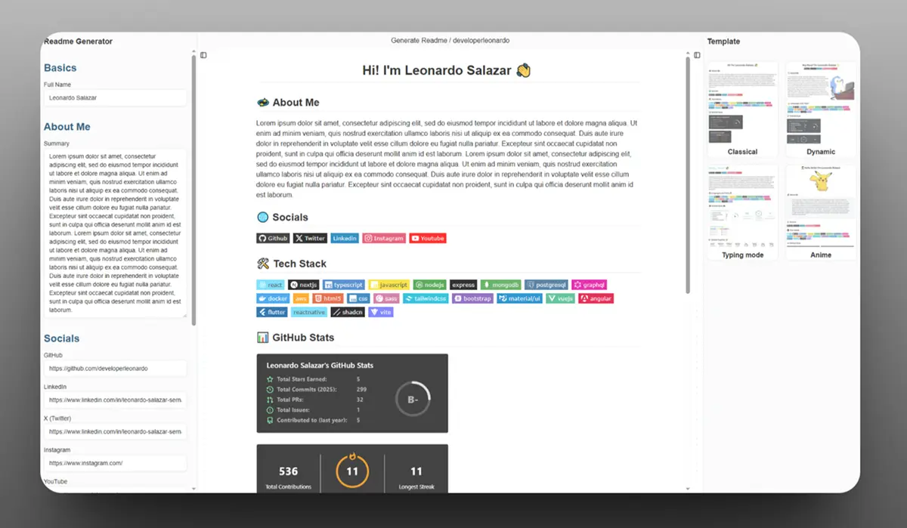

# 🚀 Github Readme Maker

Welcome to **Github Readme Maker**!  
Easily generate beautiful, personalized GitHub profile READMEs with just a few clicks.  
Showcase your skills, stats, and personality to recruiters and the open-source community!

---

## ✨ Features

- 📝 Live preview of your README as you build it
- 🎨 Multiple stylish templates to choose from
- 👤 Add your name, summary, and social links
- 🛠️ Select your tech stack from a wide range of technologies
- 📊 Display GitHub stats, trophies, and top repositories
- ⚡ Copy your generated markdown instantly

---

## 🛠️ Built With

This project leverages a modern web stack and powerful open-source tools:

| Technology                                      | Description                                    |
| ----------------------------------------------- | ---------------------------------------------- |
| [React](https://react.dev/)                     | UI library for building interactive interfaces |
| [TypeScript](https://www.typescriptlang.org/)   | Typed superset of JavaScript                   |
| [Vite](https://vitejs.dev/)                     | Lightning-fast frontend build tool             |
| [Zustand](https://zustand-demo.pmnd.rs/)        | State management for React                     |
| [TanStack Router](https://tanstack.com/router)  | Type-safe routing for React apps               |
| [TanStack Query](https://tanstack.com/query)    | Powerful data fetching & caching for React     |
| [React Hook Form](https://react-hook-form.com/) | Performant, flexible forms for React           |
| [Zod](https://zod.dev/)                         | TypeScript-first schema validation             |
| [TailwindCSS](https://tailwindcss.com/)         | Utility-first CSS framework                    |
| [shadcn/ui](https://ui.shadcn.com/)             | Beautifully designed React components          |
| [ESLint](https://eslint.org/)                   | Linting for code quality                       |
| [Prettier](https://prettier.io/)                | Code formatting                                |
| [Vercel](https://vercel.com/)                   | Deployment and hosting                         |

#### Supported Tech Stack Badges

- React, Next.js, TypeScript, JavaScript, Node.js, Express.js, MongoDB, PostgreSQL, GraphQL, Docker, AWS, HTML5, CSS, Sass, TailwindCSS, Bootstrap, MUI, Vue.js, Angular, Flutter, React Native, shadcn/ui, Vite

---

## 📸 Screenshots



---

## 🚦 Getting Started

1. **Clone the repo**

   ```sh
   git clone https://github.com/your-username/github-readme-maker.git
   cd github-readme-maker
   ```

2. **Install dependencies**

   ```sh
   pnpm install
   ```

3. **Start the development server**

   ```sh
   pnpm run dev
   ```

4. Open http://localhost:5173 in your

## 📦 Project

```sh
├── src/
│ ├── components/ # UI components & templates
│ ├── data/ # Tech stack & social data
│ ├── stores/ # Zustand state stores
│ ├── utils/ # Markdown & preview generators
│ └── ...
├── public/ # Static assets
├── [index.html](http://_vscodecontentref_/0)
├── [package.json](http://_vscodecontentref_/1)
└── ...
```

## 🤝 Contributing

Contributions are welcome!
Feel free to open issues or submit pull requests to improve the project
